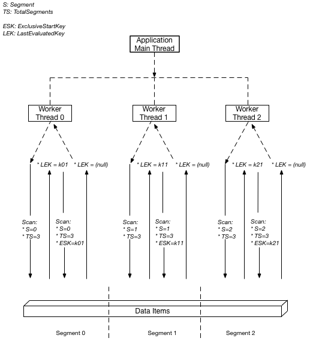

<div align="center">

<br/>
<br/>
</div>

# <div align="center">Tynamo Pscan</div>

Scanning large DynamoDB tables can be a challenging and resource-intensive task. This TypeScript library, `Tynamo Pscan`, aims to simplify the process of scanning medium to large DynamoDB tables, ensuring efficient use of available resources without causing unjustified pauses.

The aim of this library is to publish scan requests in parallel instead of sequential calls. By utilizing parallel scanning, Tynamo Pscan improves the performance of scanning operations, allowing for faster and more efficient retrieval of data from DynamoDB tables.

With Tynamo Pscan, you can easily scan large tables by specifying the desired scan options and using either the yield or callback approach. The library handles the parallel execution of scan requests, dividing the workload into smaller segments and processing them concurrently.

## Table of Contents
- [Installation](#installation)
- [Usage](#usage)
    - [Using yield](#using-yield)
    - [Using Callback](#using-callback)
- [Contributing](#contributing)
- [License](#license)

<br/>
<p align="center">
  
</p>

## Installation
```sh
$ npm install @asalam-pscan
```

## Usage


### Using yield 

```typescript
import Scanner from '@asalam/tynamo-pscan'


const scanner = new Scanner({
        client: await client({}),
        totalSegments: 1000000,
        startSegment: 0,
        batchSize: 500, //  # running segments in parallel

    })
const iterator = scanner.scan({
    scanOptions: {
        TableName: 'your-table-name',
        FilterExpression: 'attribute-exists(#email)',
        ExpressionAttributeNames: {
            '#email': 'email'
        }
    }
})
for await (batch in scanner) {
    // receiving data in batch
}
```


### Using Callback

```typescript
const iterator = scanner.scan({
    scanOptions: {
        TableName: 'your-table-name',
        FilterExpression: 'attribute-exists(#email)',
        ExpressionAttributeNames: {
            '#email': 'email'
        }
    },
    callback: batch => {
        // receiving data in batch
    }
})

await iterator.next()
```


## Contributing

We welcome contributions from the community! If you would like to contribute to this project, please follow these guidelines:

1. Fork the repository and create a new branch.
2. Make your changes and ensure that the code passes all tests.
3. Submit a pull request with a clear description of your changes.

Thank you for your interest in contributing to this project!


## License

Tynamo Pscan is licensed under the MIT License. See the [LICENSE](./LICENSE) file for more information.


## References
- [Working with scans in DynamoDB](https://docs.aws.amazon.com/amazondynamodb/latest/developerguide/Scan.html)
- [Scan vs Parallel Scan in AWS DynamoDB?](https://stackoverflow.com/questions/41268702/scan-vs-parallel-scan-in-aws-dynamodb)